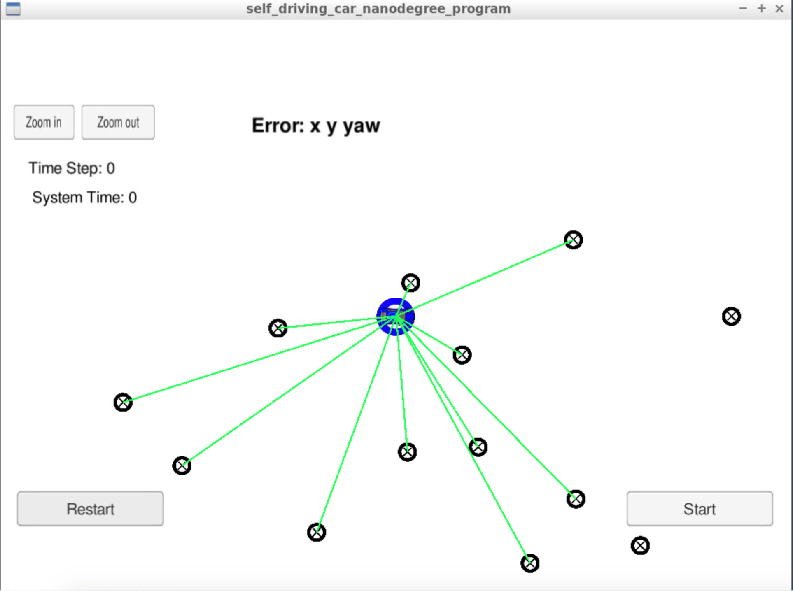
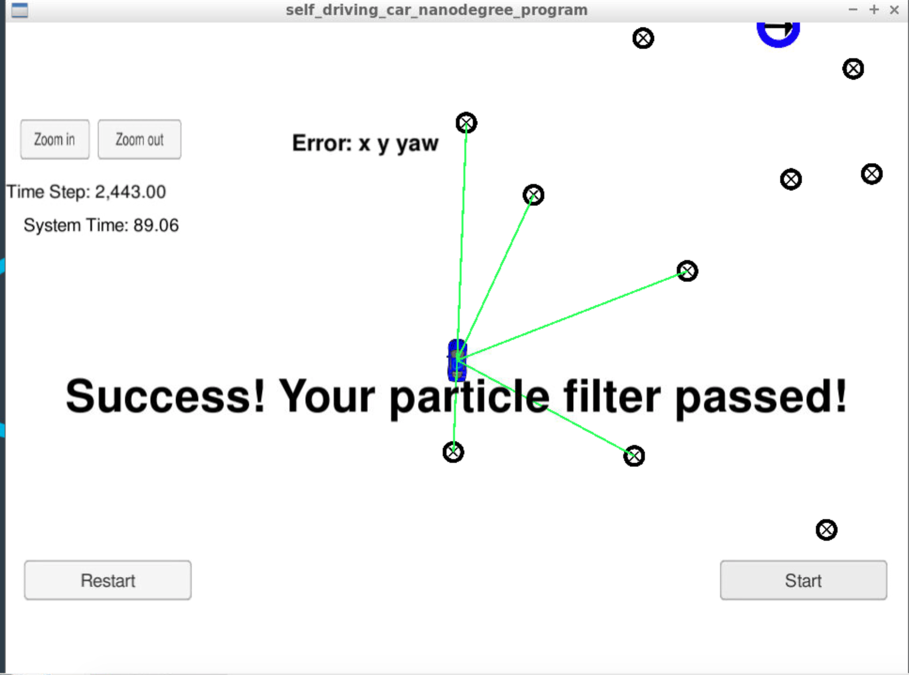

# Overview
This repository contains a working particle filter to be used in a kidnapped car scenario. The seed project comes from the Udacity's Self-Driving Car Nanodegree. This project requires the use of a [simulator](https://github.com/udacity/self-driving-car-sim/releases) and [uWebSockets](https://github.com/uNetworking/uWebSockets).


## Executing the project
In order to install the necessary prerequisite libraries, use the [install-mac.sh](./install-mac.sh).

To build and run the file, run the following from the top directory:

```
> ./clean.sh
> ./build.sh
> ./run.sh
```
Once you see a message saying "Listening to port 4567" the particle filter is waiting for the simulator.

### Running the simulator

After opening the simulator, select the Kidnapped Vehicle project from the homepage


Then you will see the following screen:


After clicking start, the car will move along the simulator as well as the particle simulator. It will output a message saying success when it is finished localizing the vehicle:

